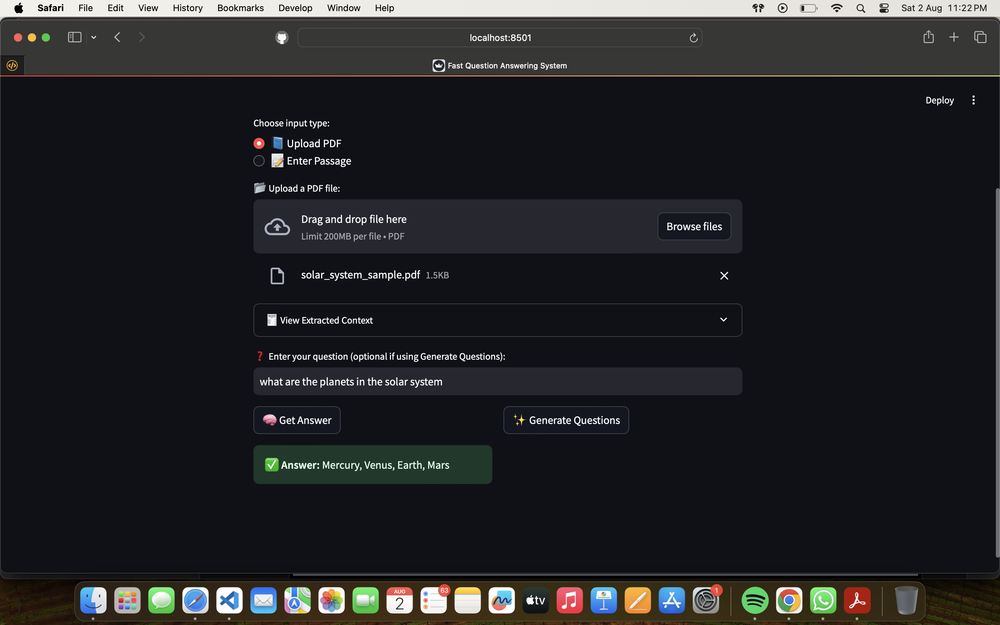
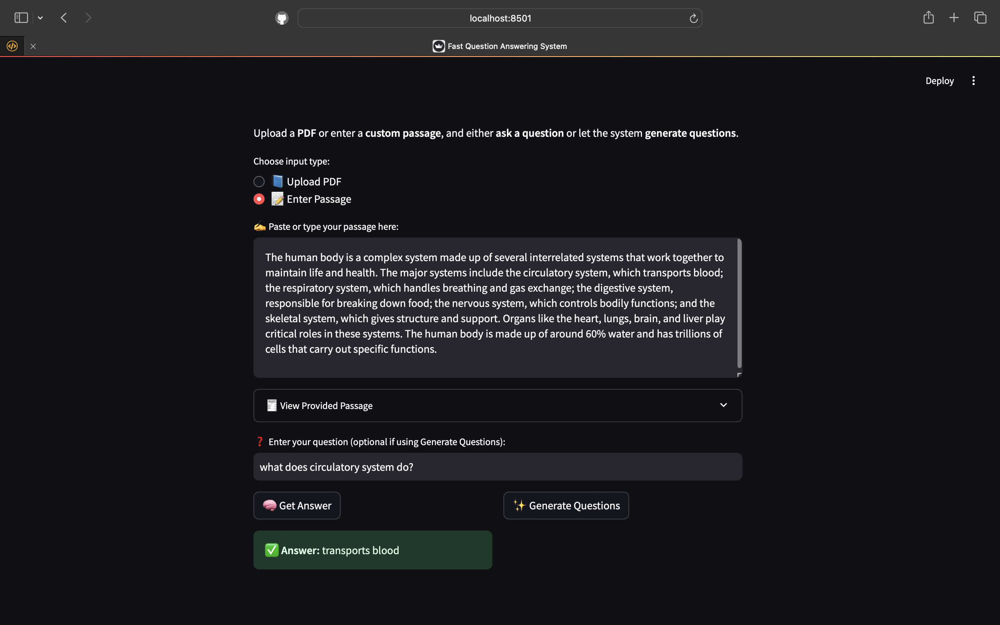

# 📄 Fast Question Answering System using Transformers & Streamlit

An interactive web app where you can upload a **PDF** or enter a custom **text passage**, then either ask a **question** or generate possible **questions** from the given content. It uses powerful pre-trained transformer models for both **question answering** and **question generation**.

---

## 🚀 Features

- 📂 Upload PDF files or enter custom passages
- ❓ Ask any question related to the passage or PDF
- ✨ Automatically generate relevant questions from the text
- 🧾 View extracted content before Q&A or generation
- 🧠 Powered by HuggingFace Transformers
- 🖥️ Built with Streamlit for an intuitive UI

---

## 🧠 Models Used

| Task                | Model                                      | Description                                                                 |
|---------------------|--------------------------------------------|-----------------------------------------------------------------------------|
| Question Answering  | `distilbert-base-uncased-distilled-squad`  | A distilled version of BERT trained on SQuAD. Lightweight, fast, and accurate. |
| Question Generation | `valhalla/t5-small-qg-prepend`             | A T5-small model fine-tuned for question generation with prepended prompts. |

> ✅ *If you want better performance, consider switching to:*
- For QA: `deepset/roberta-base-squad2`
- For QG: `iarfmoose/t5-base-question-generator` or `valhalla/t5-base-qg-hl`

---

## 📷 Screenshots

### 🧾 Upload a PDF and View Extracted Text


### ❓ Ask a Question and View the Answer


---

## 🔧 Installation

### 1. Clone the repository
```bash
git clone https://github.com/yourusername/qa-streamlit-app.git
cd qa-streamlit-app
